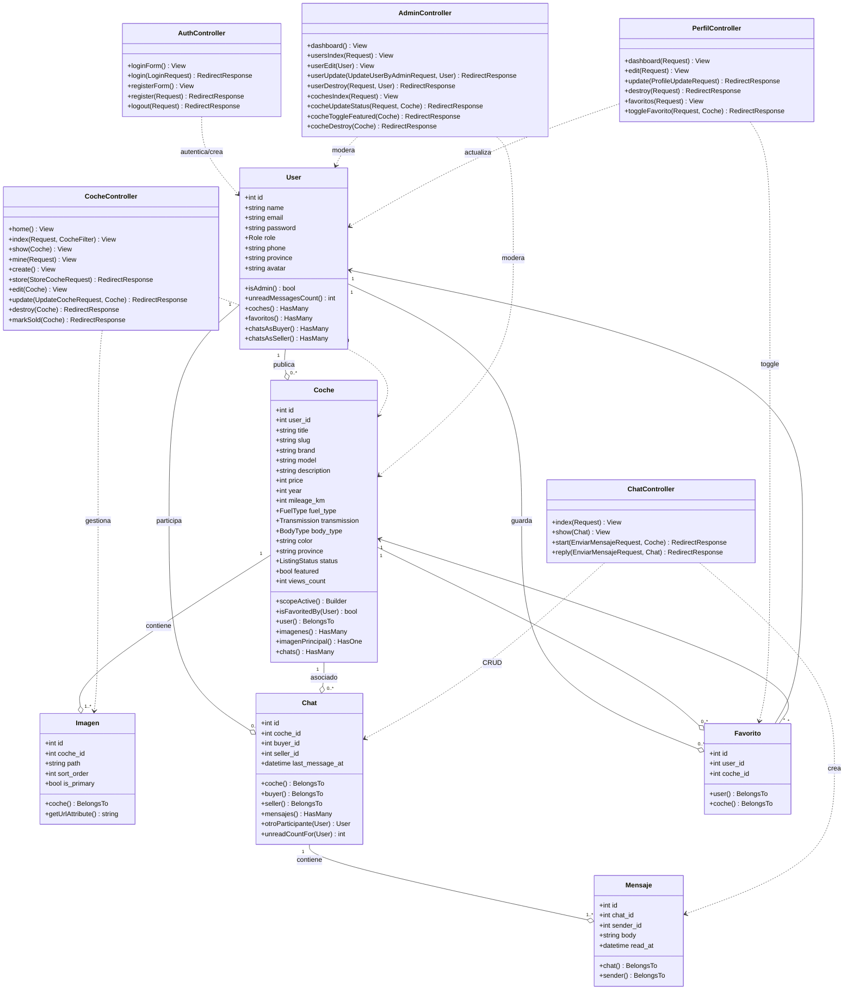
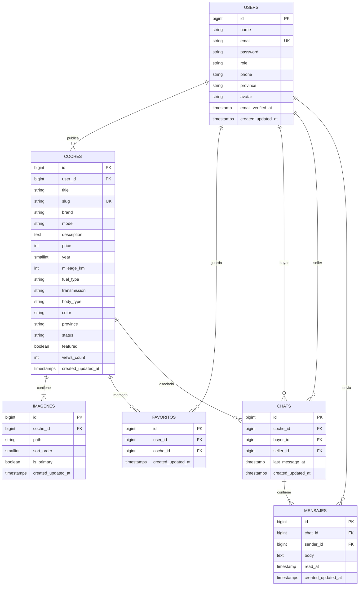
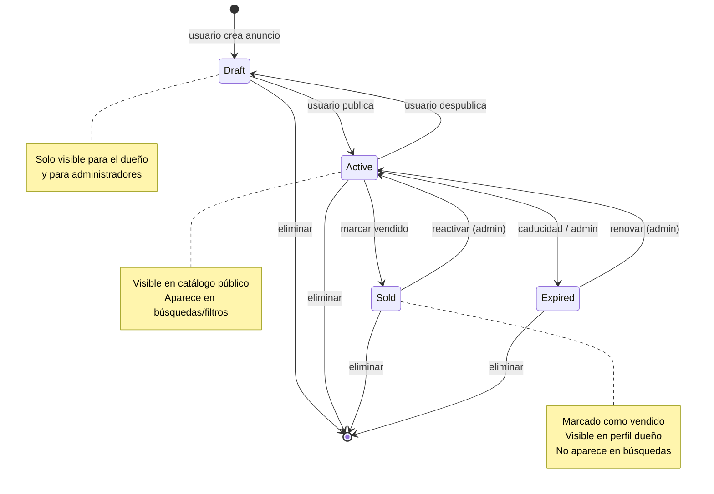
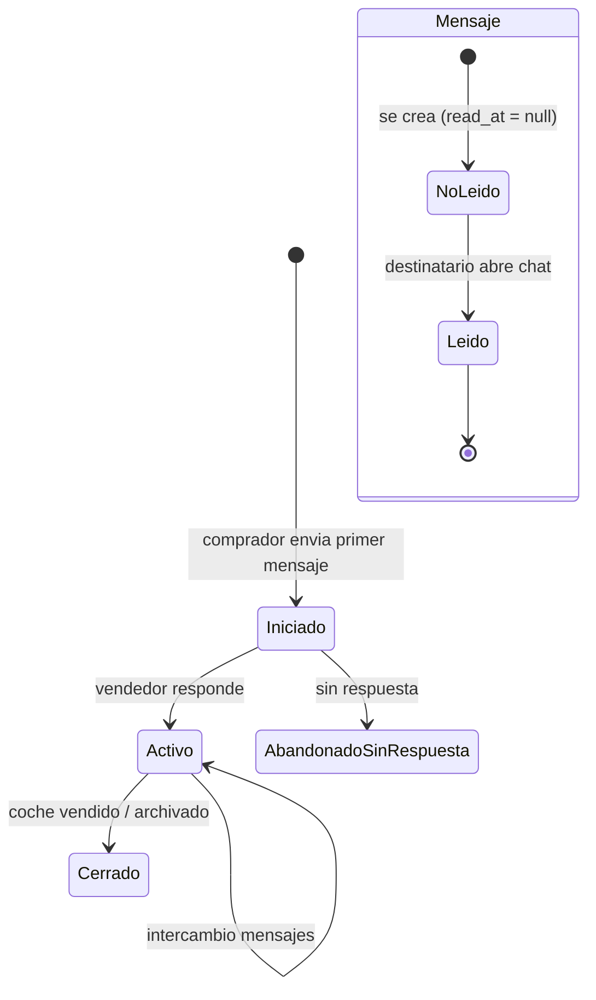
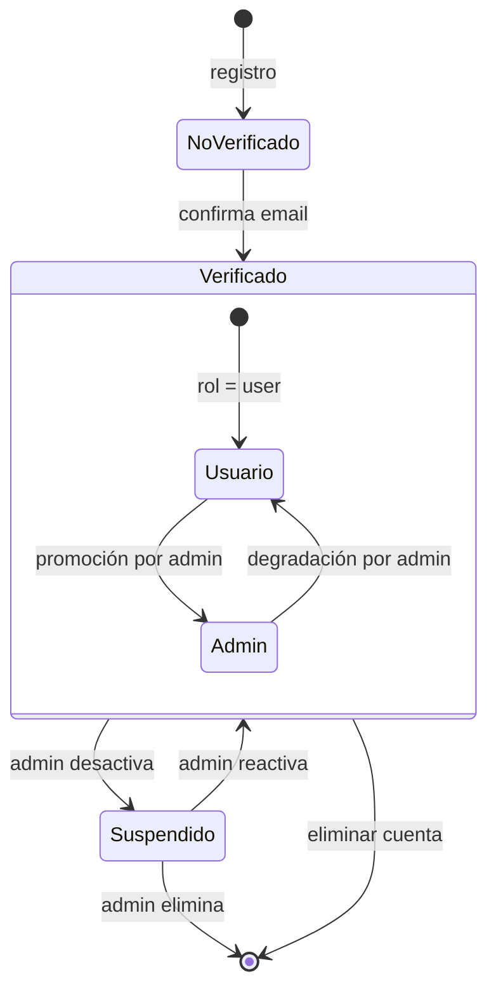

# Diagramas — Coches.app

Diagramas en formato **Mermaid** (renderizables en GitHub, VSCode, o https://mermaid.live).

---

## 1. Diagrama de clases (Modelos + Controladores)

---

## 2. Diagrama de entidad-relación (BD)

---

## 3. Diagramas de estados

### 3.1 Estados de un Coche (anuncio)

### 3.2 Estados de un Chat / Mensaje (lectura)

### 3.3 Estados de un Usuario

---

## Cómo usar estos diagramas

1. **Mermaid Live**: pega cualquier bloque en https://mermaid.live → exporta a PNG/SVG
2. **GitHub**: GitHub renderiza Mermaid nativo si pegas en un .md
3. **VS Code**: extensión "Markdown Preview Mermaid Support"
4. **Para LaTeX / TFG**: exporta a PNG desde mermaid.live y embebe en tu documento
